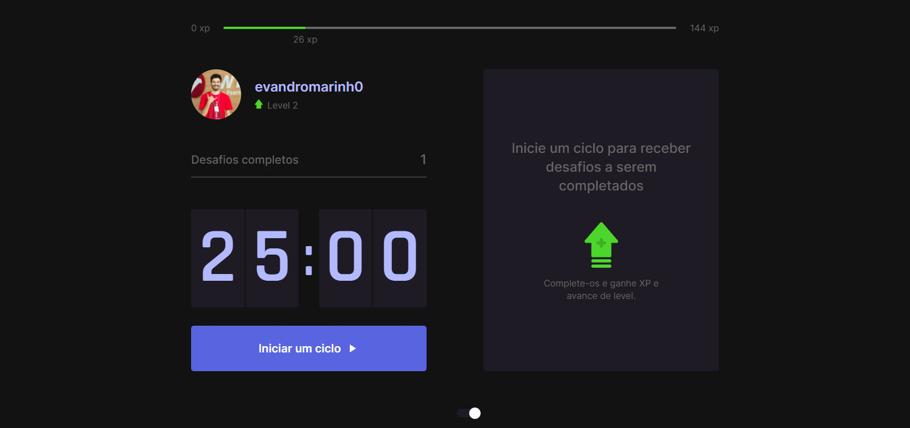
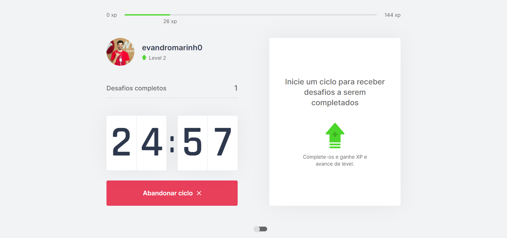

<p align="center">
   
</p>
<p align="center">	

  <a aria-label="Completed" href="https://nextlevelweek.com/episodios/react/1/edicao/4">
    </img>
  </a>
  
</p>
<p align="center">
  Move.it is gonna help you out exercising often (:
</p>

# Screenshots :camera:
<div align="center">
  
  
  
</div>

# Technologies :rocket:
This project was made using the follow technologies:
* [Typescript](https://www.typescriptlang.org/)      
* [React](https://reactjs.org/)      
* [Next.js](https://nextjs.org/)  

# Get it running :electric_plug:
```bash
# Clone Repository
$ git clone https://github.com/evandromarinh0/moveit-nextjs.git
```
```bash
# Install Dependencies
$ yarn 

# Run Aplication
$ yarn dev
```

# License :page_facing_up:

This project is under the [MIT license](./LICENSE).

